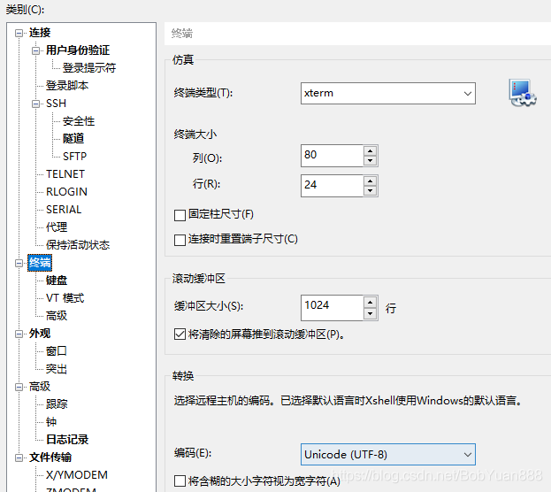

# ubuntu 终端更改为中文

[参考链接](https://blog.csdn.net/BobYuan888/article/details/88662779)

#### 一、首先查看是否安装了中文语言包

```bash
locale -a
```

查看是否有：

```bash
zh_CN.utf8
```

如果没有，首先需要安装中文语言包，输入以下命令：

```bash
sudo apt-get install language-pack-zh-hans
```

然后添加中文支持

<pre class="language-bash"><code class="lang-bash"><strong>sudo locale-gen zh_CN.UTF-8</strong></code></pre>

#### 二、修改locale文件配置

```bash
sudo vim /etc/default/locale
```

修改配置文件为：

```bash
LANG="zh_CN.UTF-8"
LANGUAGE="zh_CN:zh:en_US:en"
LC_NUMERIC="zh_CN.UTF-8"
LC_TIME="zh_CN.UTF-8"
LC_MONETARY="zh_CN.UTF-8"
LC_PAPER="zh_CN.UTF-8"
LC_IDENTIFICATION="zh_CN.UTF-8"
LC_NAME="zh_CN.UTF-8"
LC_ADDRESS="zh_CN.UTF-8"
LC_TELEPHONE="zh_CN.UTF-8"
LC_MEASUREMENT="zh_CN.UTF-8"
LC_ALL=zh_CN.UTF-8
```

#### 三、重启

```bash
sudo reboot
```

#### 四、如果还是不行，请检查终端的语言设置

比如我用的是xshell，点击属性-》终端-》编码，选择UTF-8




#### 五、修改为英文

同修改为中文，如果没安装英文语言包可以安装：

```bash
sudo apt-get install language-pack-en
```

然后添加英文支持

```bash
locale-gen en_US.UTF-8
```

修改配置文件

```bash
vim /etc/default/locale
```

```bash
LANG=en_US.UTF-8
LANGUAGE="en_US:en"
LC_NUMERIC="en_US.UTF-8"
LC_TIME="en_US.UTF-8"
LC_MONETARY="en_US.UTF-8"
LC_PAPER="en_US.UTF-8"
LC_IDENTIFICATION="en_US.UTF-8"
LC_NAME="en_US.UTF-8"
LC_ADDRESS="en_US.UTF-8"
LC_TELEPHONE="en_US.UTF-8"
LC_MEASUREMENT="en_US.UTF-8"
LC_ALL=en_US.UTF-8
```

重启

```bash
reboot
```
